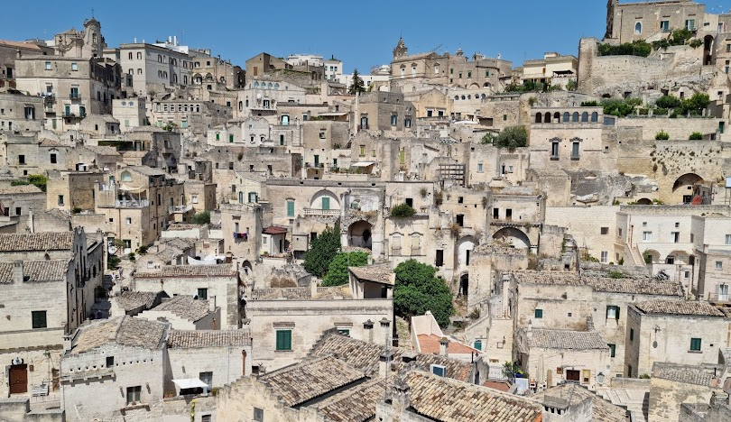

```{r setup, include=FALSE}
knitr::opts_chunk$set(echo = TRUE, comment=" ")
# data(rock)
# dati=rock
load("rock_environment.RData")
hook_output <- knitr::knit_hooks$get("output")
 
knitr::knit_hooks$set(output = function(x, options) {
     if (!is.null(n <- options$out.lines)) {
         x <- xfun::split_lines(x)
         if (length(x) > n) {
             # truncate the output
             x <- c(head(x, n), "....\n")
         }
         x <- paste(x, collapse = "\n")
     }
     hook_output(x, options)
})
```

\clearpage

# Esplorazione dei dati

## Uno sguardo al dataset

```{r, results='asis', echo=FALSE, message=FALSE}
library(stargazer)
stargazer(rock, type="latex", summary = TRUE, 
           title= "Tabella di summary", digits = 3, header=FALSE)
```

```{r, echo=FALSE, comment=" ", out.lines= 11}
rock
```

```{r, echo=FALSE}
head(dati)
```

```{r, echo=FALSE, results='hide', comment=" "}
data = rock

data$y = rock$perm

data$x = rock$area

summary(data$x)

summary(data$y)
```

## Rappresentazione grafica

```{r, echo=FALSE, comment=" ", out.width="52%"}
plot(data$y ~ data$x, col = "blue")
```

```{r, eval=FALSE, comment=" "}
plot(data$y ~ data$x)
```

\newpage

## Regressione Lineare

```{r, echo=FALSE, comment=" ", results='asis'}
m1 = lm(perm ~ area, data = rock)
summary(m1)
stargazer(m1, type = "latex", summary = TRUE, title = "Risultati del modello", digits = 2, header = FALSE)
```

## Confronto tra modelli di regressione lineare

```{r, echo=FALSE, comment=" ", results='asis'}
m0 = lm(perm ~ 1, data = rock)
stargazer(m0, m1, type = "latex", title = "Confronto tra modelli", digits = 2, intercept.top = TRUE, intercept.bottom = FALSE, header = FALSE)
```

## Nello specifico:

```{r, echo=FALSE}
X = mean(rock$y)
data$y[1]
(data$y[1]- mean(data$y)/sd(data$y))
```

$$z_i = \frac{x_i - \bar{X}} {sd} = \frac{`r data$y[1] - mean(data$y)`} {`r  sd(data$y)`} = `r (data$y[1] - mean(data$y)) / sd(data$y) ` $$

# Rock

## Measurements on Petroleum Rock Samples

### Description

Measurements on 48 \Large rock \normalsize samples from a **\color{blue}{petroleum}** \normalcolor reservoir.

```{r cars}
summary(cars)
```

## Facciamo un passo indietro: cos'è una petroleum rock[^1]

[^1]: \color{red}[rock](https://www.youtube.com/watch?v=dQw4w9WgXcQ&ab_channel=RickAstley)  \normalcolor

Nella geologia del \Large petrolio \normalsize , la *\color{red}{roccia madre}* \normalcolor è la roccia che ha generato idrocarburi o che potrebbe generare idrocarburi. Le rocce madri sono uno degli elementi necessari per un sistema petrolifero funzionante . Sono sedimenti ricchi di sostanza organica che potrebbero essere stati depositati in una varietà di ambienti tra cui acque profonde marine , lacustri e deltizie . Lo scisto ***\color{violet}{bituminoso}*** \normalcolor può essere considerato una roccia madre ricca di materiale organico ma immatura da cui è stato generato ed espulso poco o nessun petrolio. Le metodologie di mappatura delle rocce madri del sottosuolo consentono di identificare le probabili zone di presenza di petrolio nei bacini sedimentari e nei giacimenti di gas di scisto .


```{r pressure, echo=FALSE}
plot(pressure)
```

## Tipi di rocce madri

Le rocce madri[^2] sono classificate in base ai tipi di kerogene che contengono, che a sua volta governa il tipo di idrocarburi che verranno generati: 

[^2]: \color{blue}[Rocce madri](https://en.wikipedia.org/wiki/Source_rock) \normalcolor

### Rocce madri di tipo I
Le rocce madri di tipo I sono formate da resti di alghe depositati in condizioni anossiche in laghi profondi: tendono a generare oli grezzi cerosi quando sottoposti a stress termico durante l'interramento profondo [@festa1917dialetto].

### Rocce madri di tipo II
Le rocce madri di tipo II sono formate da resti planctonici e batterici marini conservati in condizioni anossiche in ambienti marini: producono sia petrolio che gas quando vengono fessurate termicamente durante l'interramento profondo [@epifania2020implicit].

### Rocce madri di tipo III
Le rocce madri di tipo III sono formate da materiale vegetale terrestre che è stato decomposto da batteri e funghi in condizioni ossiche o subossiche: tendono a generare principalmente gas con oli leggeri associati quando vengono fessurate termicamente durante l'interramento profondo. La maggior parte dei carboni e degli scisti carbonatici sono generalmente rocce madri di tipo III [@epifania2020dscoreapp].

## Lista di sassi

- Tufo
- Granito
- Marmo
- Alessandrite

## Lista di sassi in ordine di bellezza

1. Alessandrite
2. Marmo
3. Granito
4. Tufo

## Lista di sassi
1. Alessandrite
2. Marmo
   - Il marmo bianco di Carrara
   - Il marmo Botticino classico
   - Il marmo travertino romano classico, noce e rosso persiano
   - Il marmo giallo Cleopatra e giallo reale
3. Granito
4. Tufo

Un sasso particolare: lo smeraldo.

> Provenienze dello smeraldo:
>
> - Africa
>
> - Egitto
>
> - Colombia
>
> - Brasile
 
## Città legate ai sassi:

```{r Castalda, echo=FALSE, fig.align="left", fig.cap="Sasso di Castalda", out.width="50%"}
knitr::include_graphics(path = "IMMAGINI/castalda.jpg")
```



\newpage

## Equazioni sui sassi

Facendo un po' di operazioni con i sassi avremo che: $$1 + \frac{4}{2} - \sqrt{4} = 1$$ Quindi è evidente che sia possibile fare di conto usando i sassi. 


```{r, echo=FALSE, eval=TRUE}

```


\clearpage 

# References
 
 
 
 
 
 
 
 
 
 
 
 
 
 
 
 