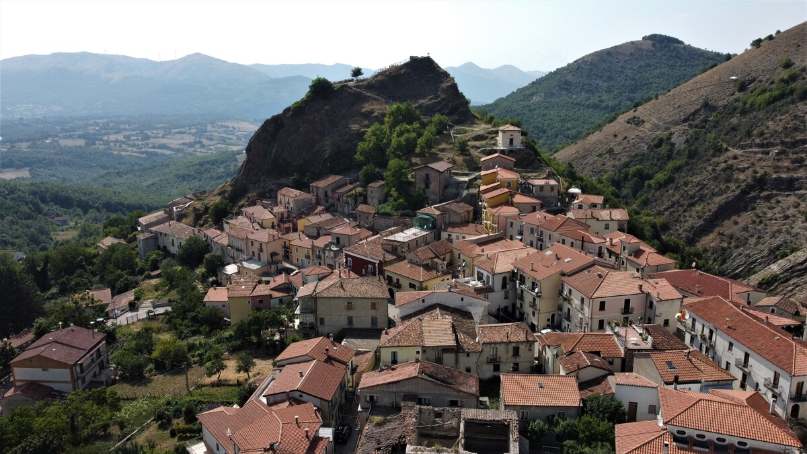

<style>
.forceBreak { -webkit-column-break-after: always; break-after: column; }
.myClass {font-size: 14px;}
</style>

```{css echo=FALSE}
pre {
  max-height: 700px;
  overflow-y: auto;
}

pre[class] {
  max-height: 500px;
}

.scroll-100 {
  max-height: 500px;
  overflow-y: auto;
  background-color: inherit;
}
```

```{r setup, include=FALSE}
knitr::opts_chunk$set(echo = FALSE)
```

# Rock 

## Petroleum Rocks

### Idrocarburi

Nella geologia del petrolio, la roccia madre è la roccia che ha generato idrocarburi o che potrebbe generare idrocarburi. Le rocce madri sono uno degli elementi necessari per un sistema petrolifero funzionante . Sono sedimenti ricchi di sostanza organica che potrebbero essere stati depositati in una varietà di ambienti tra cui acque profonde marine , lacustri e deltizie . Lo scisto bituminoso può essere considerato una roccia madre ricca di materiale organico ma immatura da cui è stato generato ed espulso poco o nessun petrolio. Le metodologie di mappatura delle rocce madri del sottosuolo consentono di identificare le probabili zone di presenza di petrolio nei bacini sedimentari e nei giacimenti di gas di scisto .


# Città legate ai sassi

## Roccanova

### Anche conosciuta come ***NewRock***

```{r, fig.cap = "NewRock", fig.align="center", out.width="50%"}
knitr::include_graphics(path = "roccanova.jpg")
```

## Matera

### L'iconica <span style="color:blue"> città dei sassi </span>

```{r, fig.cap = "***Matera***", fig.align="center", out.width="50%"}
knitr::include_graphics(path = "matera.jpg")
```

## Sasso di castalda

### Letteralamente un castello costruito sopra un sasso

Sasso di Castalda (U Sàsse in dialetto lucano)  è un comune italiano di 745 abitanti della provincia di Potenza in Basilicata.


## Le due facce delle Petroleum Rocks {.build}

<div style="float: left; width: 40%; text-align: left;">

La <span style="color:violet"> Lucania </span>  è una terra ricca di idrocarburi, è la regione italiana più ricca di petrolio e greggio, copre da sola più del 90% delle estrazioni nazionali.

</div>

<div style="float: right; width: 55%; text-align: left;">

La zona in cui vengono fatte la maggior parte delle estrazioni è la Val D'Agri, vicino ad un paese chiamato Viggiano.

```{r, fig.cap = "Viggiano", fig.align="center", out.width="80%"}
knitr::include_graphics(path = "viggiano.jpg")
```

</div>


## Codici che meritano attenzione

```{r echo=TRUE, class.output="scroll-100"}
for(i in 1:nrow(rock)) {
  
  if (rock[i, "perm"] >= 6.3 & rock[i, "perm"] <= 17.1) {
    
    rock[i, "area"] = "A"
    
  } else if (rock[i, "perm"] >= 58.6 & rock[i, "perm"] <= 100) {
    
    rock[i, "area"] = "B"
    
  } else if (rock[i, "perm"] >= 119 & rock[i, "perm"] <= 142) {
    
    rock[i, "area"] = "C"
    
  } else {
    
    rock[i, "area"] = "D"
    
  }
}
```


